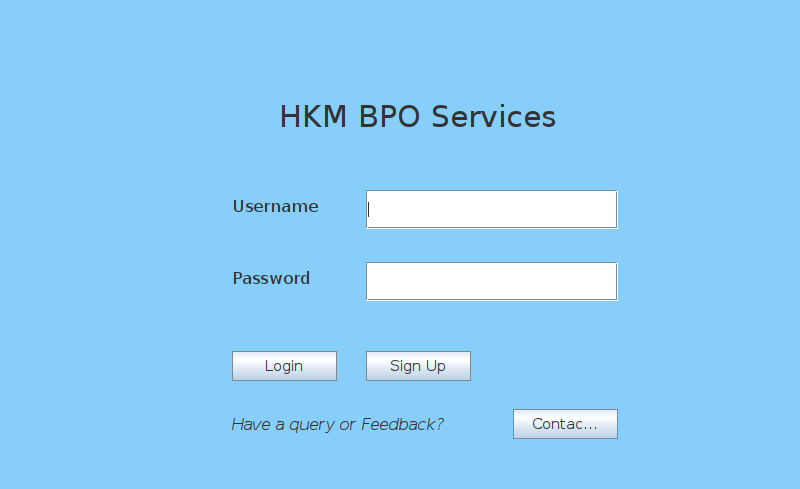
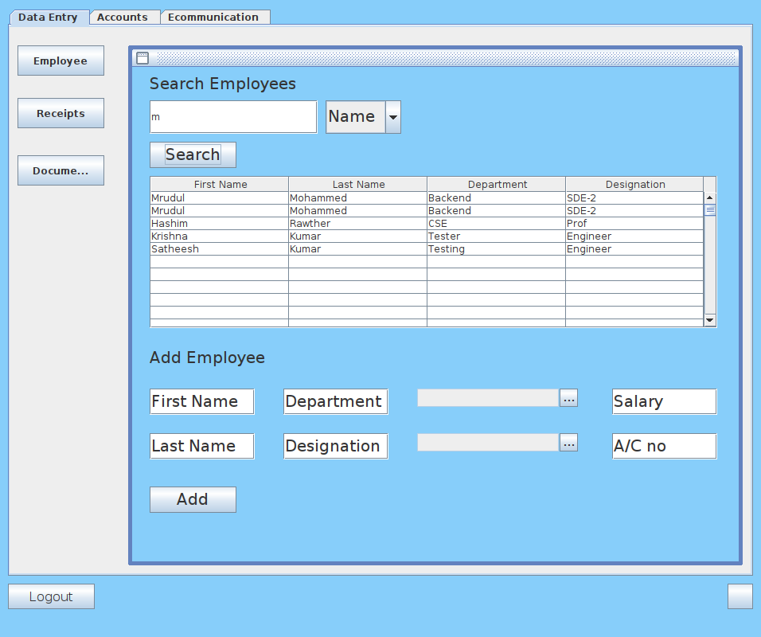
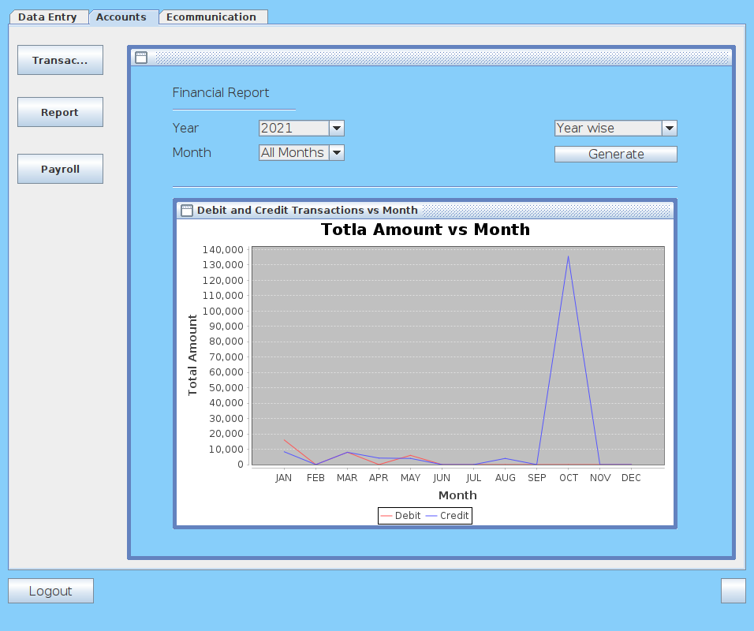
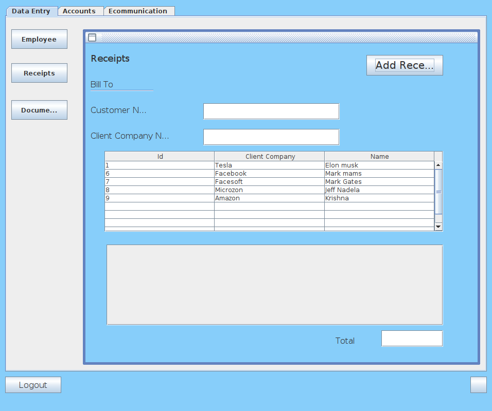

# BPO(Business Process Outsourcing)
 A desktop application written in java that lets client companies to register for a set of services like data management, finance and account management
 and e-communication services. 
 <h4>List of tools used to build this software:</h4>
 <ul>
  <li> Frontend GUI was built using WindowBuilder.</li>
  <li> Backend APIs were written in Java </li>
  <li> MySQL database to store persistent data </li>
 </ul>
 
 <h4> To run the application: </h4>
 <ul>
  <li>Clone this repository</li>
  <li>cd into the src folder and change the database credentials in the config.java file </li>
  <li>cd into the src/Frontend folder and run the SignIn.java file. </li>  
 </ul>
 
<h4> Glimpse of the GUI of the application:- </h4>

    </img>

     </img>

 

    </img>
    </img>

 
 
 
      
